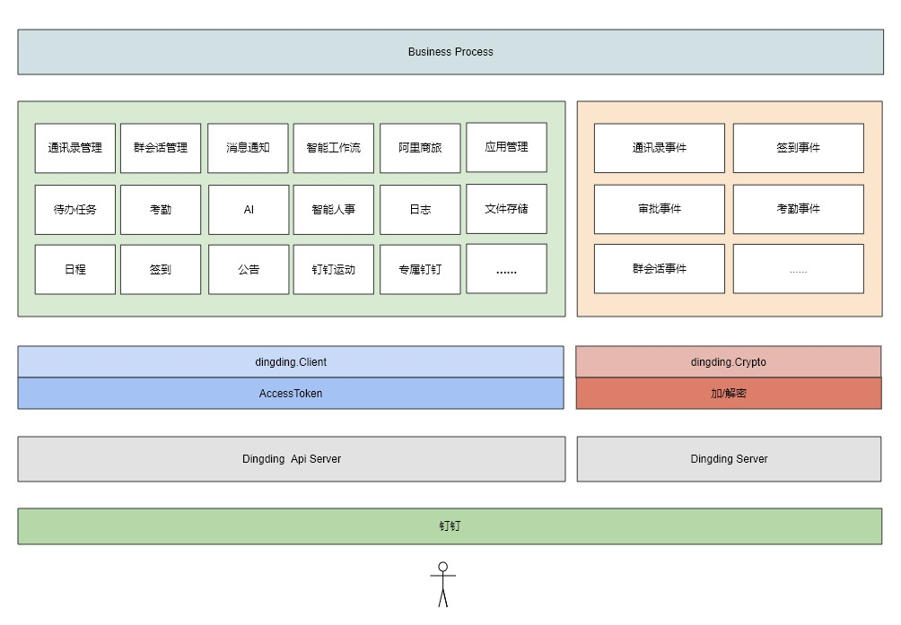

# fastwego/dingding

A fast [dingding](https://ding-doc.dingtalk.com/) development sdk written in Golang

[](https://pkg.go.dev/github.com/fastwego/dingding?tab=doc)
[](https://goreportcard.com/report/github.com/fastwego/dingding)

## 快速开始 & demo

```shell script
go get github.com/fastwego/dingding
```
```go

// 钉钉 AccessToken 管理器
atm := &dingding.DefaultAccessTokenManager{
    Id:   DingConfig["AppKey"],
    Name: "access_token",
    GetRefreshRequestFunc: func() *http.Request {
        params := url.Values{}
        params.Add("appkey", DingConfig["AppKey"])
        params.Add("appsecret", DingConfig["AppSecret"])
        req, _ := http.NewRequest(http.MethodGet, dingding.ServerUrl+"/gettoken?"+params.Encode(), nil)

        return req
    },
    Cache: file.New(os.TempDir()),
}

// 钉钉 客户端
DingClient = dingding.NewClient(atm)

// 调用 api
params := url.Values{}
params.Add("mobile", "13800138000")
req, _ := http.NewRequest(http.MethodGet, "/user/get_by_mobile?"+params.Encode(), nil)
resp, err := DingClient.Do(req)
```

完整的演示项目：

[https://github.com/fastwego/dingding-demo](https://github.com/fastwego/dingding-demo)


## 架构设计



## 框架特点

- 使用 Go 语言，开发快、编译快、部署快、运行快，轻松服务海量用户
- 丰富的[文档](https://pkg.go.dev/github.com/fastwego/dingding) 和 [演示代码](https://github.com/fastwego/dingding-demo) ，快速上手，5 分钟即可搭建一套完整的钉钉服务
- 独立清晰的模块划分，快速熟悉整个 sdk，没有意外，一切都是你期望的样子
- 直接调用接口，最少封装，自由嵌入业务逻辑
- 简单而强大的 AccessToken 管理：
    - 默认将 AccessToken 缓存到本机临时目录下
    - 过期自动重新获取
    - 支持自定义 AccessToken 的获取和管理方法，扩展应用场景
    - 支持企业内部应用/第三方企业应用/第三方个人应用不同类型的 AccessToken 管理
- 接口调用失败自动重试
- 事件回调加解密处理
- 丰富完整&支持自定义的日志
- 支持自定义 http.Client：
    - 默认使用 http.DefaultClient


## 活跃的开发者社区

fastwego 是一套丰富的 Go 开发框架，支持钉钉、飞书、微信等服务，拥有庞大的开发者用户群体

你遇到的所有问题几乎都可以在社区找到解决方案

欢迎提交 pull request / issue / 文档，一起让钉钉开发更快更好！

Faster we go together!

[加入开发者交流群](https://github.com/fastwego/fastwego.dev#%E5%BC%80%E5%8F%91%E8%80%85%E4%BA%A4%E6%B5%81%E7%BE%A4)
